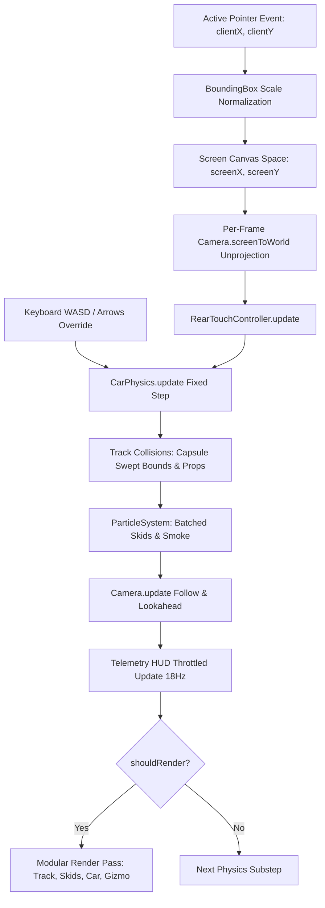

# Top-Down 2D Car Engine Architecture

## Overview
**topdown-2d-car-engine** is a modular, high-performance 2D car driving engine designed for top-down and isometric driving games. Built with React 19, TypeScript, and HTML5 Canvas 2D, it features realistic arcade vehicle physics, an intuitive single-finger push-behind touch control scheme, real-time telemetry HUD, in-game tuning drawer, and cross-platform export support (Web, Itch.io iframe sandbox, and native Android APK via Capacitor).

---

## Directory Structure
```
topdown-2d-car-engine/
├── docs/                                # Engine specifications & documentation suite
│   ├── DESIGN_DOC.md                    # Overarching system design & architecture roadmap
│   ├── ARCHITECTURE.md                  # System architecture, pipeline, and platform design (this file)
│   ├── VEHICLE_PHYSICS.md               # 2D vehicle dynamics, drift mechanics, and presets
│   ├── CONTROLS_REAR_TOUCH.md           # Rear-touch push-behind steering math & touch unprojection
│   ├── UI_ART_DIRECTION.md              # Fresh Pop & Bright Minimalist art direction, fonts & 60s re-skinning
│   ├── INTEGRATION_GUIDE.md             # Plug-and-play decoupling & custom sprite integration guide
│   └── AGENTS.md                        # AI coding assistant invariants & prompt cheatsheet
├── scripts/                             # Automated portable build & environment scripts
│   ├── setup-mobile-env.ps1             # Portable JDK 21 + Android command-line tools bootstrap
│   ├── build-apk.ps1                    # Android APK compilation pipeline (Gradle via wrapper)
│   └── build-itch.ps1                   # Itch.io zip packager with cross-origin headers
├── dump/                                # Output directory for builds & packaged zips (gitignored)
├── public/                              # Static public assets (icons, manifest)
├── src/
│   ├── App.tsx                          # Root application container & component composition
│   ├── main.tsx                         # React 19 root mount point
│   ├── vite-env.d.ts                    # Vite client typings
│   ├── vite-plugin-crossorigin.ts       # Vite dev plugin adding COOP/COEP headers
│   ├── components/
│   │   ├── common/
│   │   │   └── BoundingBox.tsx          # Responsive viewport scaler with Capacitor APK detection
│   │   ├── debug/
│   │   │   ├── DebugMenu.tsx            # Slide-out glassmorphic tuning drawer with presets & sliders
│   │   │   └── TelemetryHUD.tsx         # Speedometer, G-force, slip angle, FPS & reset controls
│   │   └── game/
│   │       └── CarCanvas.tsx            # Primary simulation loop, input handlers, and multi-layer renderer
│   ├── engine/
│   │   ├── CarPhysics.ts                # 2D vehicle dynamics, friction, drift decay, and zero-allocation wheel buffer
│   │   ├── RearTouchController.ts       # Rear bumper anchor push-to-drive & steer math (in-place telemetry)
│   │   ├── Camera.ts                    # Dynamic follow camera with speed lookahead and car-up rotation
│   │   ├── ParticleSystem.ts            # Batched tire skid mark persistence and smoke puff simulation
│   │   ├── ITrack.ts                    # Generic track & collision contract with surface properties
│   │   ├── Track.ts                     # Standalone fallback rectangular arena implementing ITrack
│   │   ├── renderers/                   # Modular Canvas 2D renderers
│   │   │   ├── CarRenderer.ts           # Procedural chassis, wheels, headlights, brake glow & aero
│   │   │   ├── GizmoRenderer.ts         # Rear-touch interactive tether & circle HUD gizmo
│   │   │   └── DebugRenderer.ts         # Real-time velocity, heading & drift vector renderer
│   │   └── __tests__/                   # Automated Vitest simulation test suites
│   │       ├── CarPhysics.test.ts       # Powertrain, braking, drag decay & reverse steering tests
│   │       ├── RearTouchController.test.ts # Anchor math, deadzones & push-steer tests
│   │       └── Camera.test.ts           # Coordinate projection & bijective inversion tests
│   ├── hooks/
│   │   └── useGameLoop.ts               # Fixed-timestep (120Hz) accumulator loop with shouldRender flag
│   ├── stores/
│   │   ├── useCarConfigStore.ts         # Zustand store for physics tuning constants & presets
│   │   └── useGameStore.ts              # Zustand store for control mode, telemetry state, and UI toggles
│   ├── demo/                            # Detachable demo presentation layer (showroom, presets, proving ground)
│   │   ├── carPresets.ts                # 5 Car presets (Apex GT, Track Phantom, Tokyo Drifter, etc.)
│   │   ├── track/
│   │   │   └── DemoTrack.ts             # Motorsport Proving Ground (flying/respawn cones, solid trees, curbs)
│   │   └── components/
│   │       ├── CarPreview.tsx           # Standalone top-down vector vehicle preview canvas
│   │       └── CarSelectModal.tsx       # Vehicle showroom dialog with 3-stat ratings and DRIVE action
│   └── styles/
│       ├── theme.css                    # Centralized theme tokens (Lilita One, Be Vietnam Pro, chunky buttons)
│       ├── ui-components.css            # Modular UI classes (.btn-chunky, .ui-card, .ui-modal-sheet)
│       └── global.css                   # Viewport resets, safe areas, and touch-action handling
├── capacitor.config.ts                  # Capacitor native runtime configuration
├── package.json                         # Dependencies (React 19, Zustand 5, Framer Motion 12, Lucide)
├── tsconfig.json                        # TypeScript root project references
└── vite.config.ts                       # Vite bundling configuration with React plugin
```

---

## Coordinate Systems & Units

### 1. World Coordinate System
- **Orientation**: Standard Canvas 2D Cartesian plane where $+X$ points **Right** and $+Y$ points **Down**.
- **Angles**: Expressed in **Radians** normalized to $[-\pi, \pi]$.
  - Angle $0\text{ rad}$ points along the $+X$ axis (East / Right).
  - Initial heading $\theta_0 = -\pi/2\text{ rad}$ points along the $-Y$ axis (**North / Up**).
- **Physical Scale**:
  - Distance: Virtual canvas pixels (car length is $64\text{ px}$, width is $32\text{ px}$; $1\text{ meter} \approx 20\text{ px}$).
  - Speed: Pixels per second ($\text{px/s}$). Real-time speedometer converts to $\text{km/h}$ via $\text{Speed}_{\text{km/h}} = \text{Speed}_{\text{px/s}} \times 0.25$ (calibrated so 200 px/s corresponds to 50 km/h).
  - Acceleration / Braking: Pixels per second squared ($\text{px/s}^2$).
  - Angular Velocity: Radians per second ($\text{rad/s}$).

### 2. Screen & Viewport Scaling
- **Logical Resolution**: $480 \times 880\text{ px}$ (9:16.5 portrait smartphone aspect ratio).
- **Aspect Handling (`BoundingBox.tsx`)**:
  - **Desktop Web / Itch.io Sandbox**: Calculates `scale = Math.min(availW / 480, availH / 880)` and applies CSS transform `scale(...)` centered on the viewport with simulated phone frame styling (`box-shadow`, `border-radius`). Clamps available dimensions against physical screen bounds.
  - **Capacitor & Mobile Web / Mobile Itch.io**: Automatically detects mobile browsers and native Capacitor shells, activating a 100% fluid, unscaled, borderless layout (`scale: 1`) to eliminate letterbox borders across all mobile screen ratios.
- **DPR Scaling**: The canvas internal backing buffer matches `(width * DPR, height * DPR)` where `DPR = Math.min(window.devicePixelRatio, 2)` to eliminate blurriness on Retina / OLED displays while maintaining 60 FPS.
- **Input Coordinate Mapping**: Pointer events (`clientX`, `clientY`) are normalized using `scaleX = logicalW / rect.width` and `scaleY = logicalH / rect.height` before passing through the camera's inverse transform.

---

## Camera System (`Camera.ts`)

The camera delivers a dynamic chase-cam experience tailored for portrait phone screens:
1. **Vertical Anchor Offset (`anchorYFactor = 0.60`)**:
   - Anchors the vehicle at $60\%$ down the screen height, placing the car in the lower-middle portion of the display.
   - This leaves $40\%$ of unobstructed screen space below the vehicle, providing room for the player's thumb/finger during rear-touch steering without obscuring forward visibility.
2. **Speed-Proportional Lookahead**:
   - Lookahead offset: $\Delta_{\text{lookahead}} = \min(\text{speed}, 250) \times 0.22$.
   - Projects camera target ahead along the vehicle's forward vector so higher speeds reveal more track ahead.
   - Position smoothed using exponential damping: $t = 1 - e^{-7.5 \cdot \Delta t}$.
3. **Car-Up Heading Rotation**:
   - Target camera rotation is $\theta_{\text{cam}} = \theta_{\text{car}} + \pi/2$, which rotates the world so the vehicle always points **straight up** on the player's screen.
   - Rotation smoothed using shortest-arc modular difference with damping: $t_{\text{rot}} = 1 - e^{-8.0 \cdot \Delta t}$.
4. **Coordinate Transformation Pipeline**:
   - **Forward (`applyTransform`)**: Screen center translation $\to$ zoom scale $\to$ camera un-rotation $\to$ camera position translation.
   - **Inverse (`screenToWorld`)**: Un-anchors screen coordinates $\to$ un-scales zoom $\to$ un-rotates by camera angle $\to$ translates by camera world $(x, y)$.

---

## Game Loop & Simulation Pipeline

The game loop runs via `useGameLoop` with a **120 Hz fixed-timestep accumulator** (`fixedStepMs = 1000 / 120 ≈ 8.33ms`) and frame-time clamping ($\Delta t \le 100\text{ ms}$). This guarantees deterministic vehicle handling and drift friction decay across 60 Hz, 120 Hz, and mobile throttled displays, while executing Canvas 2D rendering only on display frames (`shouldRender = true`):



### Pipeline Execution Steps:
1. **Input Sampling & Continuous Hold Projection**:
   - Touch coordinates are tracked in screen space. Every frame, `camera.screenToWorld()` unprojects the current thumb position to world coordinates, maintaining steady throttle even when holding a thumb completely stationary.
   - In `rear-touch` mode, the touch world coordinate is projected against the car's rear bumper anchor point.
   - Computes normalized throttle $[-1..1]$ and steering $[-1..1]$ signals.
   - Keyboard inputs (`WASD` or Arrow keys) remain active as developer overrides.
2. **Physics Integration (`CarPhysics.update`)**:
   - Stepped at fixed discrete intervals ($\Delta t = 1/120\text{s}$).
   - Projects current global velocity $(v_x, v_y)$ into vehicle local longitudinal and lateral axes.
   - Applies powertrain drive acceleration or active braking / reverse force.
   - Applies natural rolling drag decay: $v_{\text{long}} \times (\text{naturalDrag})^{\Delta t \cdot 60}$.
   - Applies lateral tire friction decay: $v_{\text{lat}} \times (\text{driftFactor})^{\Delta t \cdot 60}$.
   - Computes speed-dependent steering authority with smooth angular velocity convergence.
   - Reconstructs global velocity and integrates world position $(x, y)$ and heading angle $\theta$.
   - Evaluates slip angle and flags drift state if slip angle $> 16^\circ$ and speed $> 45\text{ px/s}$.
3. **Collision Detection & Response (`Track.ts` / `DemoTrack.ts`)**:
   - **Perimeter Arena Walls**: Constrains car inside arena boundaries (`[-1200, 1200]` in `Track.ts`, `[-1350, 1350]` in `DemoTrack.ts`) with elastic bounce ($e = 0.45$), wall sliding friction ($0.85$), and angular velocity damping ($0.4$).
   - **Obstacles & Cones (Two-Circle Swept Capsule)**: In `DemoTrack.ts`, obstacles are tested against a swept spine capsule (radius $17\text{ px}$, spine length $36\text{ px}$ from rear to front axle), preventing front bumper and rear tail clipping through trees, barriers, and cones.
4. **Particle & Skid System (`ParticleSystem.ts`)**:
   - Tracks world positions of all 4 wheels via zero-allocation `car.getWheelPositions()`.
   - Records persistent tire skid mark segments when drifting or hard braking.
   - Segments are rendered in batched alpha buckets, dropping draw calls from ~600 down to 3.
   - Emits expanding semi-transparent smoke puffs behind sliding wheels.
5. **Camera Tracking (`Camera.ts`)**:
   - Smoothly updates camera focus position with forward velocity lookahead and heading rotation.
6. **Telemetry Dispatch (`TelemetryHUD.tsx`)**:
   - Throttled to $55\text{ ms}$ ($\sim 18\text{ Hz}$) intervals using atomic Zustand selectors to avoid redundant React re-renders.
   - Publishes ground displacement speed ($\text{px/s}$ and $\text{km/h}$), slip angle, estimated lateral G-force, throttle, steering, drift flag, and measured FPS to `useGameStore`.
7. **Canvas Render Pass (`CarCanvas.tsx`)**:
   - Executed only when `shouldRender = true` on the final substep before display presentation.
   - Delegates to modular renderers: `track.render()`, `particles.render()`, `drawRearTouchGizmo()`, `drawCar()`, and `drawDebugVectors()`.
   - **Layer 1**: Clear canvas and apply camera transformation matrix.
   - **Layer 2**: Track environment — lush grass lawn, dark asphalt arena ground, coordinate grid lines, curb barriers, finish line, slalom cones, trees, and billboards.
   - **Layer 3**: Particle layer — persistent skid marks and smoke particles.
   - **Layer 4**: Interactive Rear-Touch Gizmo — rear bumper anchor point, throttle push radius, deadzone dash ring, and elastic tether line.
   - **Layer 5**: Vehicle chassis — drop shadow, steered front wheels, rear wheels, body shell, cockpit, windshield, headlights with radial light cones, and reactive brake lights.
   - **Layer 6**: Debug vectors (when enabled) — cyan forward heading vector and green/orange velocity vector.

---

## State Management Architecture

State is cleanly separated into two Zustand stores:
- **`useCarConfigStore`**: Stores all live-tunable physics constants, control sensitivity radii, preset configurations (`arcade-default`, `street-drift`, `track-grip`, `heavy-muscle`), and visual toggles.
- **`useGameStore`**: Stores transient game runtime state including active control mode (`rear-touch` vs. `keyboard`), debug menu open/close state, camera zoom level, pause flag, and real-time telemetry data.
