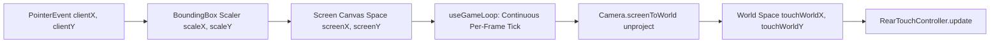

# Rear-Touch Push Steering ("Touch-Behind" Control Scheme)

## Overview & Design Concept
Piloted using a single finger placed behind the rear bumper:
- **Pushing directly behind the bumper** pushes the vehicle forward, with throttle proportional to push distance.
- **Deflecting the finger left or right** relative to the vehicle's longitudinal axis exerts steering torque, intuitively swinging the rear tail into turns (counter-rotational push steering).
- **Placing the finger ahead of the rear bumper** (towards the vehicle cabin) triggers active braking and reverse gear.
- **Lifting the finger** releases throttle and allows natural rolling resistance to coast the car smoothly.

This scheme eliminates virtual steering wheels, floating joysticks, and on-screen button clusters, allowing complete vehicle control with a single thumb or finger.

---

## Mathematical Formulation

The push-steering logic is implemented in `src/engine/RearTouchController.ts`.

### 1. Rear Anchor Point
Let the vehicle center in world coordinates be $\vec{P}_{\text{car}} = (x, y)$ and heading angle be $\theta$.
The unit forward and right vectors in canvas world space are:
$$\vec{u}_{\text{fwd}} = (\cos\theta, \sin\theta)$$
$$\vec{u}_{\text{right}} = (-\sin\theta, \cos\theta)$$

The rear bumper anchor point $\vec{P}_{\text{anchor}}$ is situated a configurable distance $d_{\text{anchor}}$ behind the vehicle center:
$$\vec{P}_{\text{anchor}} = \vec{P}_{\text{car}} - d_{\text{anchor}} \cdot \vec{u}_{\text{fwd}}$$
where $d_{\text{anchor}} = \text{config.rearAnchorDistance}$ (default $55\text{ px}$).

```
          [ Front Wheels ]
                 ▲
                 │  +u_fwd (Vehicle Heading)
           ┌─────┴─────┐
           │           │
-u_right ◄─┤  (x, y)   ├─► +u_right
           │           │
           └─────┬─────┘
                 │
                 ▼  -u_fwd
           [Rear Anchor] (P_anchor)
                 │
                 ▼  pushBehindDist
              [Finger] (T)
```

### 2. Relative Touch Vector in Local Car Space
Given the current pointer position in world coordinates $\vec{T} = (T_x, T_y)$, the displacement vector from the rear anchor to the touch is:
$$\vec{\Delta} = \vec{T} - \vec{P}_{\text{anchor}} = (\Delta_x, \Delta_y)$$

We project $\vec{\Delta}$ onto the vehicle's local axes:
- **Longitudinal Offset** ($\Delta_{\text{long}}$):
  $$\Delta_{\text{long}} = \vec{\Delta} \cdot \vec{u}_{\text{fwd}} = \Delta_x \cos\theta + \Delta_y \sin\theta$$
  - $\Delta_{\text{long}} < 0$: Finger is located **behind** the rear bumper anchor (push zone).
  - $\Delta_{\text{long}} > 0$: Finger is located **ahead** of the rear bumper anchor (braking / reverse zone).

- **Lateral Offset** ($\Delta_{\text{lat}}$):
  $$\Delta_{\text{lat}} = \vec{\Delta} \cdot \vec{u}_{\text{right}} = -\Delta_x \sin\theta + \Delta_y \cos\theta$$
  - $\Delta_{\text{lat}} > 0$: Finger is to the **right** of the vehicle spine.
  - $\Delta_{\text{lat}} < 0$: Finger is to the **left** of the vehicle spine.

### 3. Throttle & Push Force Dynamics
The push distance behind the rear bumper is defined as:
$$\text{pushBehindDist} = -\Delta_{\text{long}}$$

The throttle output is evaluated with a deadband $\epsilon_{\text{deadzone}}$ (`rearDeadzone`):
1. **Forward Acceleration** ($\text{pushBehindDist} > \epsilon_{\text{deadzone}}$):
   $$\text{effectiveDist} = \text{pushBehindDist} - \epsilon_{\text{deadzone}}$$
   $$\text{throttle} = \min\left(\frac{\text{effectiveDist}}{R_{\text{push}}}, 1.0\right)$$
   where $R_{\text{push}} = \text{config.rearPushRadius}$ (default $110\text{ px}$).

2. **Active Braking & Reverse** ($\text{pushBehindDist} < -\epsilon_{\text{deadzone}}$):
   $$\text{brakeDist} = |\text{pushBehindDist}| - \epsilon_{\text{deadzone}}$$
   $$\text{throttle} = -\min\left(\frac{\text{brakeDist}}{R_{\text{push}} \times 0.75}, 1.0\right)$$
   A tighter $0.75 \times$ radius ensures responsive emergency braking when pressing ahead of the rear bumper.

3. **Deadzone Neutral** ($|\text{pushBehindDist}| \le \epsilon_{\text{deadzone}}$):
   $$\text{throttle} = 0$$

### 4. Steering Calculation
In rear-touch push-steering, touching to the right of the car exerts a lateral force that pushes the rear tail to the right, causing the vehicle's nose to pivot to the **left** (analogous to swinging the back end):

1. **Active Turn** ($|\Delta_{\text{lat}}| > \epsilon_{\text{deadzone}}$):
   $$\text{effectiveLat} = |\Delta_{\text{lat}}| - \epsilon_{\text{deadzone}}$$
   $$\text{steer}_{\text{raw}} = -\text{sign}(\Delta_{\text{lat}}) \cdot \min\left(\frac{\text{effectiveLat}}{R_{\text{steer}}}, 1.0\right)$$
   where $R_{\text{steer}} = \text{config.rearSteerMaxOffset}$ (default $85\text{ px}$).

2. **Steer Inversion**:
   If `config.invertSteer` is toggled `true`:
   $$\text{steer} = -\text{steer}_{\text{raw}}$$
   Otherwise:
   $$\text{steer} = \text{steer}_{\text{raw}}$$

3. **Center Deadzone** ($|\Delta_{\text{lat}}| \le \epsilon_{\text{deadzone}}$):
   $$\text{steer} = 0$$
   This prevents steering wobble when the player intends to push in a straight line.

---

## Screen-to-World Touch Pipeline

Because the game supports responsive scaling (`BoundingBox.tsx`) and dynamic camera follow with rotation (`Camera.ts`), touch inputs undergo a multi-step transformation before reaching `RearTouchController`:



1. **Pointer Capture & Tracking**:
   - On `onPointerDown`, `(e.target as HTMLElement).setPointerCapture(e.pointerId)` locks all continuous gesture events to the canvas, preventing pointer loss when dragging near screen edges.
   - The active pointer ID is captured to prevent multi-touch collisions from UI clicks or resting fingers.
2. **Bounding Box Normalization**:
   - `rect = canvas.getBoundingClientRect()`
   - $\text{scaleX} = \text{logicalW} / \text{rect.width}$
   - $\text{scaleY} = \text{logicalH} / \text{rect.height}$
   - $\text{screenX} = (e.\text{clientX} - \text{rect.left}) \times \text{scaleX}$
   - $\text{screenY} = (e.\text{clientY} - \text{rect.top}) \times \text{scaleY}$
3. **Continuous Per-Frame Camera Unprojection (`camera.screenToWorld`)**:
   - When a finger is held stationary on a touch screen, browsers fire *no* `pointermove` events.
   - To maintain continuous forward throttle without requiring constant finger wiggling, the active screen coordinate `(screenX, screenY)` is stored and re-unprojected **on every frame of the game loop** using the latest camera position and rotation:
     $$\text{centeredX} = (\text{screenX} - W_{\text{view}} / 2) / \text{zoom}$$
     $$\text{centeredY} = (\text{screenY} - H_{\text{view}} \times 0.60) / \text{zoom}$$
     $$x_{\text{rot}} = \text{centeredX} \cos(\theta_{\text{cam}}) - \text{centeredY} \sin(\theta_{\text{cam}})$$
     $$y_{\text{rot}} = \text{centeredX} \sin(\theta_{\text{cam}}) + \text{centeredY} \cos(\theta_{\text{cam}})$$
     $$\vec{T}_{\text{world}} = (x_{\text{rot}} + C_x, y_{\text{rot}} + C_y)$$
   - This ensures the relative distance between vehicle rear bumper and touch point remains stable while the car travels at high speed.

---

## Interactive Visual Gizmo (`src/engine/renderers/GizmoRenderer.ts`)

When `showTouchGizmo` is active and touch is detected, the canvas overlays a reactive HUD gizmo (modularized in [`GizmoRenderer.ts`](../src/engine/renderers/GizmoRenderer.ts)):
1. **Rear Anchor Point**: Cyan dot ($r = 6\text{ px}$, `#00f2fe`) drawn at the vehicle's rear bumper.
2. **Push Radius Circle**: Semi-transparent cyan boundary ring ($r = R_{\text{push}}$, `rgba(0, 242, 254, 0.2)`) visualizing the $100\%$ throttle push limit.
3. **Deadzone Dashed Ring**: Subtle dashed circle ($r = \epsilon_{\text{deadzone}}$, line dash `[4, 4]`) visualizing the neutral deadband.
4. **Elastic Tether Line**: Connects the rear anchor to the active touch point:
   - **Cyan** (`#00f2fe`) during forward throttle.
   - **Crimson** (`#ff3366`) during active braking or reverse.
   - **Slate Gray** (`#94a3b8`) when idling inside the deadzone.
5. **Finger Ring Indicator**: Outer $22\text{ px}$ halo and solid white $4\text{ px}$ central reticle tracking the contact point.

---

## Configuration & Tuning Parameters

Exposed in `useCarConfigStore` and live-adjustable in `DebugMenu.tsx`:

| Parameter | Type | Default | Range | Description |
|-----------|------|---------|-------|-------------|
| `rearAnchorDistance` | `number` | `55` | 20 – 120 px | Distance behind vehicle center where rear anchor is located |
| `rearPushRadius` | `number` | `110` | 60 – 220 px | Push distance behind anchor required to reach 100% throttle |
| `rearSteerMaxOffset` | `number` | `85` | 40 – 150 px | Lateral offset required to reach 100% steering lock |
| `rearDeadzone` | `number` | `10` | 0 – 30 px | Center deadband radius to prevent wobble when driving straight |
| `invertSteer` | `boolean` | `false` | `true` / `false` | Invert lateral steering direction |
| `showTouchGizmo` | `boolean` | `false` | `true` / `false` | Toggle rendering of the push tether ring and target lines (off by default) |

### Preset Defaults for Rear Touch:
- **Arcade Default**: Anchor $55\text{ px}$, Push Radius $110\text{ px}$, Steer Offset $85\text{ px}$, Deadzone $10\text{ px}$.
- **Street Drift**: Anchor $60\text{ px}$, Push Radius $120\text{ px}$, Steer Offset $90\text{ px}$, Deadzone $8\text{ px}$.
- **Track Grip**: Anchor $50\text{ px}$, Push Radius $100\text{ px}$, Steer Offset $75\text{ px}$, Deadzone $10\text{ px}$.
- **Heavy Muscle**: Anchor $65\text{ px}$, Push Radius $130\text{ px}$, Steer Offset $95\text{ px}$, Deadzone $12\text{ px}$.

---

## Keyboard Dev Fallback
In addition to rear-touch, desktop development mode is supported via keyboard:
- `W` / `ArrowUp`: 100% Throttle
- `S` / `ArrowDown`: 100% Brake / Reverse
- `A` / `ArrowLeft`: 100% Steer Left
- `D` / `ArrowRight`: 100% Steer Right
- `R`: Instant Vehicle & Physics Reset
